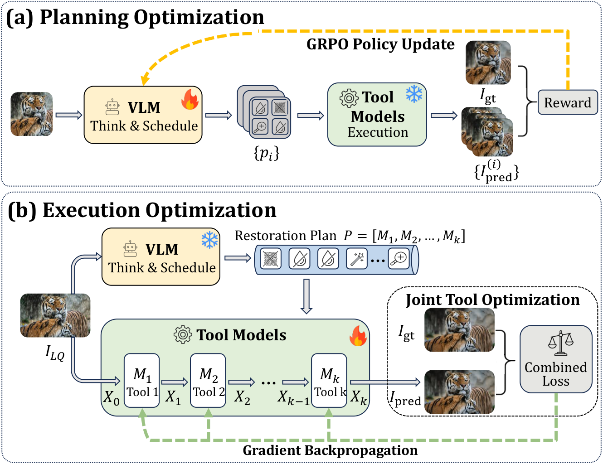

<!-- <p align="center">
  
</p> -->

<h1 align="center">OPERA: An Agent for Image Restoration with End-to-End Joint Planning–Execution Optimization</h1>

<!-- <p align="center">
  <a href="#"></a>
  <a href="#"></a>
  <a href="#"></a>
  <a href="#"></a>
</p> -->

<p align="center">
  <b>OPERA is a unified agentic framework for complex image restoration.</b>
</p>

---

## Highlights

- **Agent-based restoration planning**: formulates image restoration as a sequential decision-making problem. A vision-language model analyzes degraded images and automatically selects an ordered sequence of restoration tools.
- **End-to-end agent optimization**:  OPERA departs from a hand-crafted, step-by-step decision-making workflow and instead trains an agent to generate a
complete tool-invocation plan end-to-end.
- **Multi-tool cooperative optimization**: integrates Restormer, X-Restormer, and SwinIR into a unified framework, where agent-guided tool training are used for better cooperation.

---

## Updates

- Initial release of OPERA codebase.

---

## Overview

<p align="center">
  
</p>

---

## Repository Structure

```
Opera/
├── verl/                         # Planning Training framework (verl, submodule)
│   └── recipe/restoration/       # OPERA-specific GRPO training recipe
│       ├── run.bash              # Training launch script
│       └── reward_function.py    # IQA-based reward computation
├── tools/                        # Tool models and inference services
│   ├── restormer/                # Model architectures and training code
│   │   ├── models/               # Restormer / X-Restormer / SwinIR
│   │   ├── training/             # Joint multi-model training
│   │   └── inference/            # Standalone inference scripts
│   ├── prepare_data/             # Tool model data preparation
│   ├── inference_service/        # Load-balanced REST API service
│   └── requirements.txt
├── prepare_data/                 # Agent training data preparation
│   ├── crop.py                   # Crop HQ images to ≤ 1M pixels
│   ├── fast_synthesis.py         # Synthesize LQ images (multi-degradation)
│   └── process_train_data.py     # Format data for verl
├── inference/                    # Single-image inference
│   ├── inference_single_image.py
│   └── planning_server.bash      # vLLM server launch script
└── README.md
```

---

## Environment Setup

OPERA requires two separate conda environments.

**Planning agent environment** (verl + vLLM):

```bash
conda create -n opera-agent python=3.10 -y
conda activate opera-agent
```

Follow the [verl documentation](https://verl.readthedocs.io) to install verl and its dependencies.

**Tool model environment**:

```bash
conda create -n opera-tool python=3.10 -y
conda activate opera-tool

# Install PyTorch (choose based on your CUDA version)
pip install torch==2.1.0 torchvision==0.16.0 --index-url https://download.pytorch.org/whl/cu118

pip install -r tools/requirements.txt
```

Verify Installation:
```bash
python tools/verify_cuda_env.py
```

---

## Tool Model Training


### Prepare Tool Model Training Data

> Run all commands from the repository root with `conda activate opera-tool`.

```bash
cd tools/prepare_data

# 1. Crop HQ images to ≤ 1M pixels
python crop.py

# 2. Synthesize degraded images
python fast_synthesis.py

# 3. Generate restoration plans via VLM
python get_plan.py

# 4. Generate training configuration files from plans
python config_generator.py

# 5. Split into train / validation sets
python split_train_val.py --val-ratio 0.1
```

This produces:
- `tools/data/Comb_Config/train_config.json`
- `tools/data/Comb_Config/val_config.json`

---

### Launch Tool Models Training

> `conda activate opera-tool`

**Quick start (interactive):**

```bash
cd tools/restormer/training
bash quick_train.sh
```

**Standard training:**

```bash
python tools/restormer/training/train_combined.py \
  --train-config tools/data/Comb_Config/train_config.json \
  --val-config   tools/data/Comb_Config/val_config.json \
  --epochs 15 \
  --device cuda:0
```

**Multi-GPU distributed training:**

```bash
CUDA_VISIBLE_DEVICES=0,1 torchrun --nproc_per_node=2 \
  tools/restormer/training/train_combined.py \
  --train-config tools/data/Comb_Config/train_config.json \
  --val-config   tools/data/Comb_Config/val_config.json \
  --distributed \
  --epochs 15
```

**Resume training:**

```bash
python tools/restormer/training/train_combined.py \
  --train-config tools/data/Comb_Config/train_config.json \
  --val-config   tools/data/Comb_Config/val_config.json \
  --resume checkpoints/<timestamp>/latest_checkpoint.pth \
  --epochs 20 \
  --device cuda:0
```

Training outputs are saved to `checkpoints/{timestamp}/`:

| Directory | Contents |
|---|---|
| `models/` | Periodic checkpoints |
| `best_models/` | Best validation checkpoint |
| `plots/` | Training curves |
| `metrics/` | Per-epoch validation metrics |

---


## Planning Agent Training

### Prepare Training Data

> Run all commands from the repository root with `conda activate opera-agent`.

#### High-Quality Images

We use the **MiOIR-Train** dataset. Optionally crop images to ≤ 1M pixels:

```bash
python prepare_data/crop.py
```

#### Low-Quality Images

Synthesize degraded images with multiple degradation combinations:

```bash
python prepare_data/fast_synthesis.py
```

#### Format for verl

Convert image pairs into the parquet format required by verl:

```bash
python prepare_data/process_train_data.py
```

---
### Deploy Restoration Tools Inferenec Services

The planning agent uses the restoration tools inference service as a reward environment during training. All three services must be running before launching agent training. See [tools/inference_service/README.md](tools/inference_service/README.md) for full deployment instructions.

In brief:

```bash
# conda activate opera-tool

# 1. Start inference workers (one per GPU slot)
CUDA_VISIBLE_DEVICES=0 python tools/inference_service/combined_api.py --port 23001 --device cuda:0
CUDA_VISIBLE_DEVICES=0 python tools/inference_service/combined_api.py --port 23002 --device cuda:0

# 2. Start IQA service
python tools/inference_service/score_webapi.py --port 23101 --device cuda:0

# 3. Start orchestration service (edit paths in the script first)
python tools/inference_service/combined_main.py
```

---

### Launch the Planning Agent Training

> `conda activate opera-agent`

#### Download the Base Checkpoint

OPERA fine-tunes [VisualQuality-R1](https://huggingface.co/TianheWu/VisualQuality-R1-7B-preview) (a Qwen2.5-VL-7B-Instruct model pre-trained on IQA tasks) as the planning agent. Download it before training:

```bash
huggingface-cli download TianheWu/VisualQuality-R1-7B-preview \
  --local-dir /path/to/VisualQuality-R1
```
---
#### Deploy Judge LLM
We incorporate a consistency reward, which requires an LLM judge to evaluate whether the reasoning process is consistent with the final plan. Deploy a compatible LLM (e.g. via vLLM) or provide an OpenAI-compatible API endpoint.

#### Launch GRPO Training
Configure and launch GRPO training:

```bash
# Edit verl/recipe/restoration/run.bash:
#   REF_MODEL_PATH  — path to the base VLM checkpoint (Visual-Quality-R1)
#   data.train_files / data.val_files — paths to the prepared parquet files
#   TOOL_BASE       — URL of the orchestration service (default: http://127.0.0.1:23200/)
#   LLM_JUDGE_BASE  — base URL of the judge LLM API (default: http://localhost:8002/v1)

bash verl/recipe/restoration/run.bash
```

---

## Inference

### Single Image Inference

> Requires the planning server and at least one inference worker to be running.

**1. Launch the planning server:**

```bash
# conda activate opera-agent
# Edit inference/planning_server.bash to set the checkpoint path first
bash inference/planning_server.bash
```

This starts a vLLM server at `http://localhost:8000` serving the fine-tuned planning agent.

**2. Launch the tool service:**

```bash
# conda activate opera-tool
CUDA_VISIBLE_DEVICES=0 python tools/inference_service/combined_api.py --port 6001 --device cuda:0
```

**3. Run inference:**

```bash
python inference/inference_single_image.py \
  --image_path /path/to/input.png \
  --output_path /path/to/output.png
```

The script sends the image to the planning agent, which outputs a restoration plan, then calls the tool service to execute it end-to-end.

---

### Reproducing Quantitative Results

#### Download Test Data

We evaluate on the same benchmark as **4KAgent**, synthesized from the **MiOIR-Test** dataset. Download the LQ test images from the [4KAgent drive link](https://drive.google.com/drive/folders/11EFPIfs8in884zK5y2AOqXPtWdZ92X5d) (`LQ/` subdirectory).

#### Prepare Configuration File

```bash
# conda activate opera-tool

# Generate restoration plans for the test images
python tools/prepare_data/get_plan.py

# Convert plans to inference configuration
python tools/prepare_data/config_generator.py \
  --plan-file tools/data/Comb_Plan/plan.json \
  --output tools/data/Comb_Config/inference_config.json
```

Configuration format:

```json
{
  "pipelines": [
    {
      "id": 1,
      "pipeline": ["restormer.derain.rain.v1", "xrestormer.dehaze.haze.v1"],
      "data": [
        {"lq": "/path/to/degraded.png", "gt": "/path/to/reference.png"}
      ]
    }
  ]
}
```

`gt` is optional; metrics are skipped for entries where it is absent.

#### Run Batch Inference

```bash
python tools/restormer/inference/combined_inference_agent.py \
  --config tools/data/Comb_Config/inference_config.json \
  --load-trained checkpoints/<timestamp> \
  --device cuda:0 \
  --result-dir Results/
```

Omit `--load-trained` to use the original pretrained weights without fine-tuning.

Results are written to `Results/`:

| File | Contents |
|---|---|
| `restored_images/` | Restored output images |
| `metrics_by_degradation.csv` | Per-image metric scores |
| `metrics_summary.json` | Aggregated statistics |

**Metrics computed:**

| Condition | Metrics |
|---|---|
| With ground truth | PSNR-Y, SSIM, LPIPS, CLIPIQA, MUSIQ |
| No ground truth | CLIPIQA, MUSIQ (no-reference only) |

---


---

## License

This project is released under the [MIT License](LICENSE).
